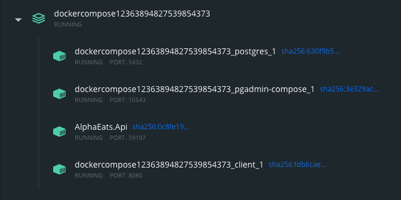
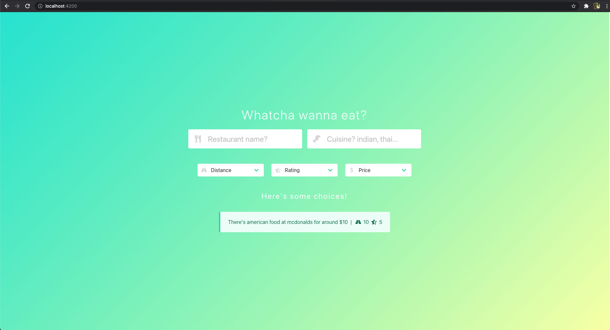
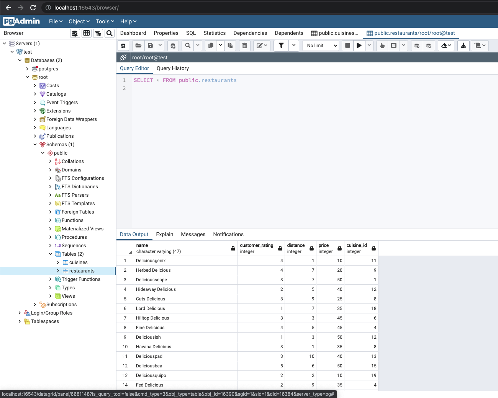
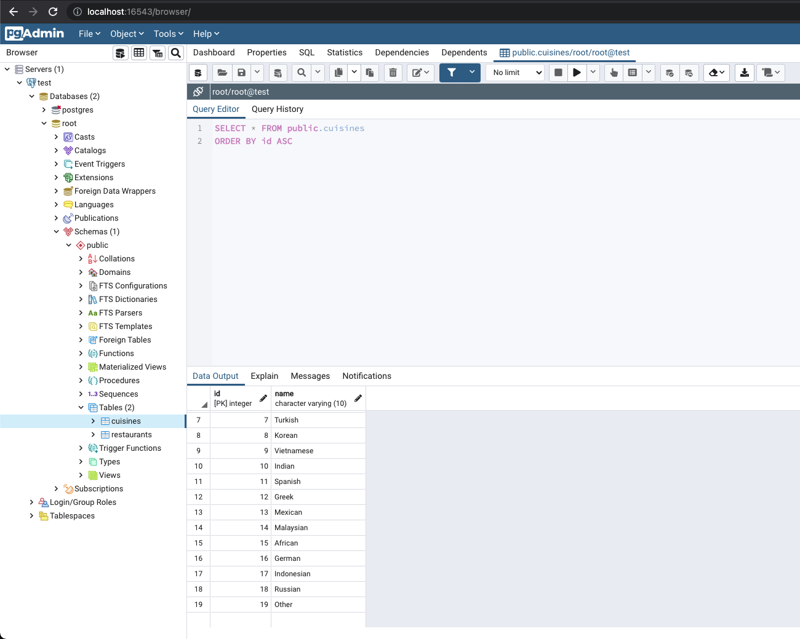

# AlphaEats Web App
A Full stack web development assessment. A quick look:  






## Author
**Sefath Chowdhury** - [linkedin](https://www.linkedin.com/in/callmesefath/)

## Project Purpose
Display skill in:
 - Front End developement 
 - Backend development 
 - Beginner DevOps development 
 - SOLID Principles (single responsibility, loose coupling, dependancy injection, etc)
 - SPA design patterns in Angular (see component structure)
 - Ability to learn new technologies while working


## Built With
* [Angular](https://angularjs.org/) - The front-end framework used
* [Postgres](https://www.postgresql.org/) - Postgres DB database
* [.NET](https://dotnet.microsoft.com/learn/dotnet/what-is-dotnet) - Backend development platform  
* [Docker](https://www.docker.com/) - Containerization solution

------
------
## Get Started
*I'm working on a Mac*

1. Here's the code tree:
```
.
├── AlphaEats.sln
├── AlphaEats.DataAccess
├── AlphaEats.Api
├── AngularClient
├── docker_postgres_init.sql
└── docker-compose.yml
```

2. Please clone and cd into AlphaEats folder
```
git clone https://github.com/Shefuchow/AlphaEats
```
```
cd AlphaEats
```

3. Run `docker-compose up`

4. Grab a coffee, snack, maybe even catch a movie, this takes a while

5. If you have Docker Desktop, here's what the containers should look like


6. Front end is on `localhost:8080`


7. Db are seeded with given CSVs (restaurant.csv and Cuisine.csv)



8. If you want, you can run this in visual studio as well, and click docker-compose as startup project and run that

## Tools Used
 - Github (version control)
 - Visual Studio (code editor)
 - IKEA mattress (for powernaps)
 - Nutribullet (for smoothies)